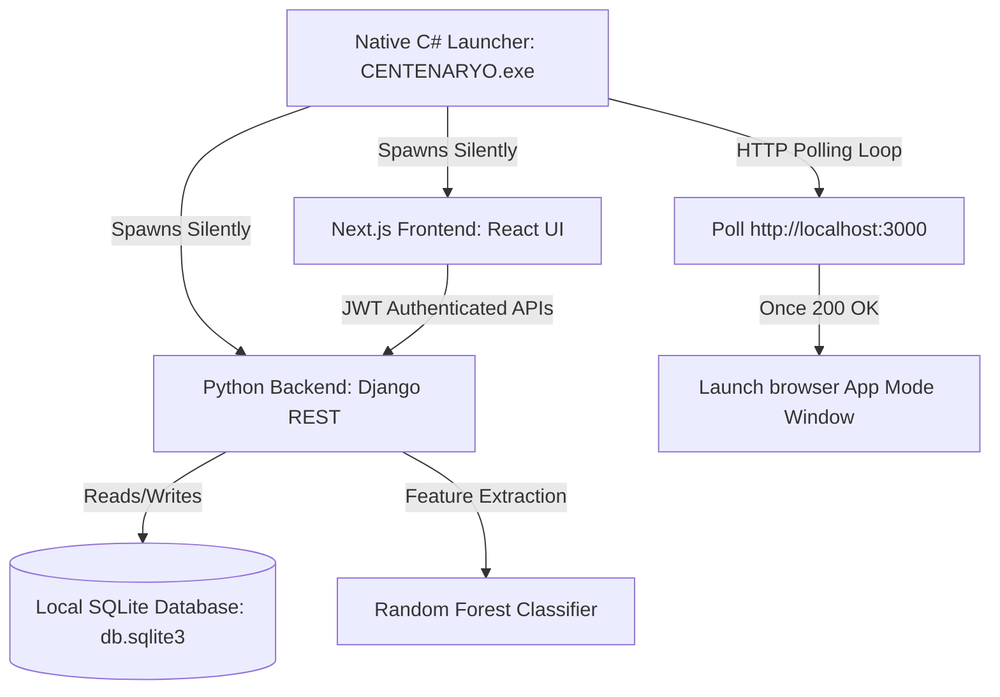
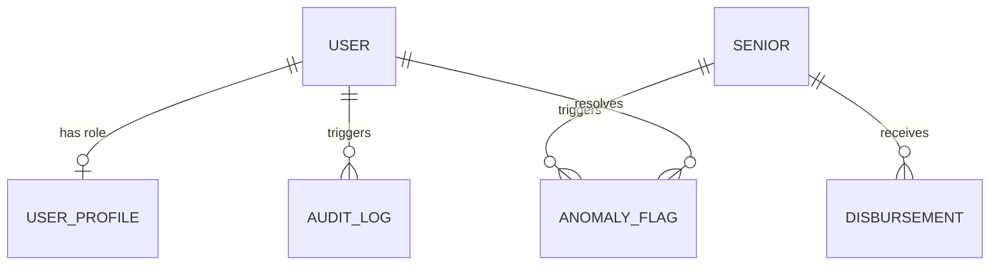
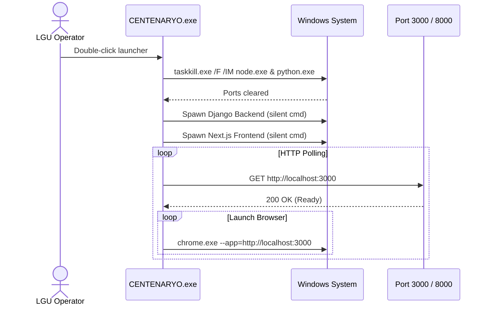
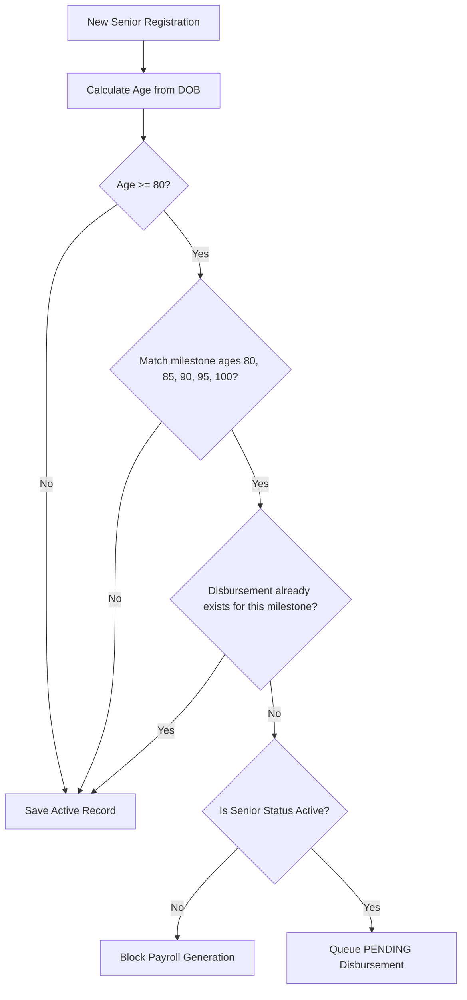
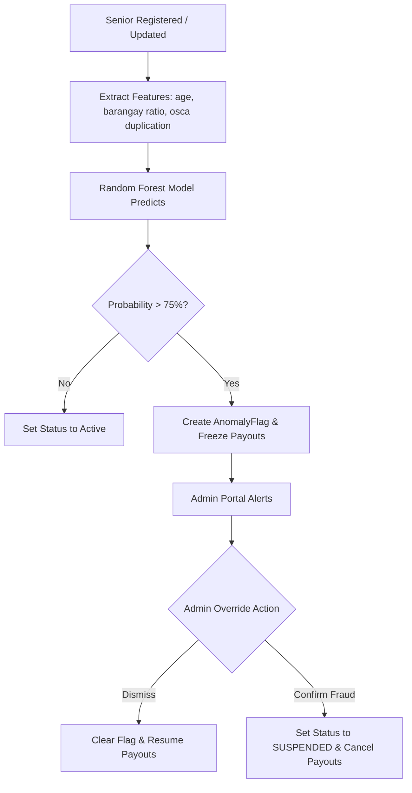

# 🇵🇭 CENTENARYO: Capstone Chapters 1-3 Draft Documentation
### System Specifications & Research Framework for the Local LGU Administrative Portal (R.A. 11982)

---

## 🏛️ CHAPTER 1: INTRODUCTION

### 1.1 Project Context & Background
The government of the Philippines enacted **Republic Act No. 11982** (The Expanded Centenarian Act), amending R.A. 10868, to provide financial milestones to senior citizens. The law grants:
*   **₱10,000** upon reaching the ages of **80, 85, 90, and 95** (Milestone Gifts).
*   **₱100,000** upon reaching the age of **100** (Centenarian Award).

At the Local Government Unit (LGU) level, administering this program has introduced major administrative bottlenecks. Registries are often managed on paper records or unstandardized spreadsheets. This fragmentation leads to:
1.  **Deceased Registry Overlaps (Ghost Voters)**: Disbursements mistakenly queued or released to deceased citizens.
2.  **Disbursement Delays**: Difficulty in tracking birthday milestones dynamically.
3.  **Data Integrity Loss**: Poor formatting of numeric IDs (e.g. leading zeros in OSCA IDs dropping off in CSV files).

**CENTENARYO** was developed to address these issues by providing a local, standalone, offline-ready desktop administration portal. The system automates milestone calculations, monitors registration anomalies using machine learning, and maintains a strict transaction audit trail.

---

### 1.2 Statement of the Problem
The implementation of R.A. 11982 at the local government level suffers from three core operational challenges:
*   **Problem 1: Fragmentation of Senior Citizen Data**  
    LGUs lack a local, unified registry that dynamically tracks ages. Spreadsheets do not update ages relative to the current calendar date, requiring staff to perform manual age calculations for thousands of entries, which introduces human error.
*   **Problem 2: Susceptibility to Disbursement Fraud & Double Claims**  
    Without real-time compliance audits, registries are vulnerable to double-claiming, identity theft, or payout releases to deceased individuals. There is no automated layer to identify statistical anomalies during the registration process.
*   **Problem 3: Technical Deployment Barriers for LGU Operators**  
    Conventional web systems depend on persistent internet connections, which are unreliable in remote LGUs. Conversely, local database setups are complex, requiring command-line installations (Node.js, Python, database servers) that non-technical office staff cannot manage or troubleshoot.

---

### 1.3 Objectives of the Study
#### General Objective:
To design, develop, and implement a secure, standalone, offline-ready LGU Desktop System called **CENTENARYO** to manage senior citizen registration, automate milestone financial payrolls, detect registry anomalies using machine learning, and verify disbursements.

#### Specific Objectives:
1.  **Develop a Zero-Configuration Native C# Launcher** (`CENTENARYO.exe`) to clean ports, manage backend/frontend background processes, and open the system in a clean, standalone desktop window.
2.  **Implement an Automated Milestone Engine** that calculates ages dynamically from birthdates and automatically queues disbursements without manual intervention.
3.  **Incorporate a Machine Learning (Random Forest) Classifier** to flag anomalies (e.g. duplicate IDs, birthdate contradictions) and instantly freeze affected payouts.
4.  **Integrate an Audit Logging Module** to track all system actions (Login, Logout, Create, Update, Delete) along with client IP addresses to comply with the **Data Privacy Act (R.A. 10173)**.
5.  **Enable Offline Portability** using a local database format (`db.sqlite3`), allowing the entire system to be shared or copied across office workstations via a flash drive.

---

### 1.4 Scope and Limitations
#### Scope:
*   **Target Population**: Senior citizens residing in the LGU jurisdiction.
*   **System Functions**: Annex A digital registration, demographic analysis (sex/civil status ratios), automatic milestone payroll generation, secure disbursement logs, Excel reports, ML anomaly resolution, and login/logout session auditing.
*   **Deployment Profile**: Offline-ready desktop application deployed directly on LGU local workstations.

#### Limitations:
*   **Offline Standalone Mode**: The application does not sync data to a cloud environment by default to maintain data privacy and offline autonomy.
*   **Workstation Dependency**: Data is stored locally on the host machine (`db.sqlite3`). Multi-computer access requires sharing the folder over a local network (LAN) or manual file syncing.

---

## 🛠️ CHAPTER 2: THEORETICAL & CONCEPTUAL FRAMEWORK

### 2.1 Technical System Framework
The architecture of **CENTENARYO** utilizes a hybrid desktop model. It runs local server instances silently in the background while presenting the interface inside a frameless native browser window:

*   **Presentation Layer (Frontend)**: Next.js 15 (React 19 & TypeScript) running in **Chrome/Edge App Mode** (a frameless standalone window wrapper). This strips away browser tabs and address bars, providing a native software layout while maintaining web compatibility.
*   **Service Layer (Backend)**: Django REST Framework providing JWT authentication, role-based controls, API routing, and data validation.
*   **Intelligence Layer (Machine Learning)**: Scikit-learn Random Forest model integrated directly into the Django transaction lifecycle.
*   **Data Layer**: SQLite, allowing data storage in a single portable file (`backend/db.sqlite3`).

---

### 2.2 Conceptual Framework (Input-Process-Output)
The conceptual model of the system is structured around the Input-Process-Output (IPO) framework:

```mermaid
graph LR
    subgraph Inputs
        I1[Senior Citizen Profiles]
        I2[OSCA IDs & DOB]
        I3[User Accounts & Roles]
        I4[Disbursement Confirmations]
    end
    subgraph Process
        P1[Auto Port Cleaning]
        P2[HTTP Ready Polling]
        P3[Milestone Payroll Check]
        P4[Random Forest Inference]
        P5[Audit Trail Logging]
    end
    subgraph Outputs
        O1[Frameless App Window]
        O2[Excel Registry Exports]
        O3[Secured Disbursements]
        O4[Session Audit Logs]
    end
    Inputs --> Process
    Process --> Outputs
```

---

## 📐 CHAPTER 3: SYSTEM METHODOLOGY & DESIGN

### 3.1 Software Development Life Cycle (SDLC)
The development follows the **Agile Prototyping Model**. This approach allows for continuous refinement of visual and security elements (such as removing profile icons, adjusting modal layering, and replacing branding assets) based on user feedback.

---

### 3.2 Database Schema & Entity Relationship Diagram (ERD)

#### Database Dictionary:

##### 1. `core_senior` (Registry)
| Field Name | Data Type | Constraints | Description |
| :--- | :--- | :--- | :--- |
| `id` | Integer | Primary Key, Auto-Increment | Unique internal record identifier. |
| `first_name` | Varchar(100) | Not Null | Biological given name. |
| `last_name` | Varchar(100) | Not Null | Biological surname. |
| `date_of_birth` | Date | Not Null | Used to calculate age and milestones. |
| `osca_id` | Varchar(50) | Unique, Not Null | Senior ID (Format: OSCA-YYYY-SERIAL). |
| `barangay` | Varchar(100) | Not Null | Geographic location within the LGU. |
| `sex` | Varchar(10) | Not Null (MALE/FEMALE) | Used for demographic statistics. |
| `civil_status` | Varchar(20) | Not Null | SINGLE, MARRIED, WIDOWED, SEPARATED. |
| `status` | Varchar(20) | Not Null | ACTIVE, DECEASED, SUSPENDED, TRANSFERRED. |
| `annex_a_data` | JSON | Nullable | Contact information, representatives, etc. |

##### 2. `core_disbursement` (Payroll)
| Field Name | Data Type | Constraints | Description |
| :--- | :--- | :--- | :--- |
| `id` | Integer | Primary Key, Auto-Increment | Unique disbursement record identifier. |
| `senior_id` | Integer | Foreign Key (core_senior.id) | Linked beneficiary. |
| `amount` | Decimal(10,2) | Not Null | ₱10,000 or ₱100,000. |
| `status` | Varchar(20) | Not Null | PENDING, RELEASED, CANCELLED. |
| `reference_number` | Varchar(100)| Unique, Nullable | Transaction confirmation ID. |
| `release_date` | DateTime | Nullable | Timestamp when payout was marked as released. |

##### 3. `core_auditlog` (Security Trail)
| Field Name | Data Type | Constraints | Description |
| :--- | :--- | :--- | :--- |
| `id` | Integer | Primary Key, Auto-Increment | Unique audit identifier. |
| `user_id` | Integer | Foreign Key (auth_user.id) | Operator who performed the action. |
| `action` | Varchar(20) | Not Null | CREATE, UPDATE, DELETE, LOGIN, LOGOUT. |
| `target_model` | Varchar(100) | Not Null | The affected database table. |
| `changes_summary`| Text | Not Null | Detailed text description of changes. |
| `ip_address` | Varchar(45) | Not Null | Client IP address. |
| `created_at` | DateTime | Not Null, Auto-Now-Add | Audit timestamp. |

---

### 3.3 System Algorithms & Workflows

#### 1. Zero-Configuration Startup & Port Hygiene Loop (C# Launcher)

#### 2. Milestone Eligibility and Duplicate Prevention Workflow

#### 3. AI-Powered Anomaly Monitoring & Administrative Override

---

### 3.4 Verification & Validation Plan
*   **Unit Testing**: The backend contains Django unit tests (`core/tests.py`) verifying age milestone boundary conditions (80, 85, 90, 95, 100) and duplicate claim blocks.
*   **UAT (User Acceptance Testing) Parameters**:
    1.  **Portability Test**: Verify the system sets up and runs on a clean Windows machine after running `setup_new_pc.bat` without manual command-line execution.
    2.  **Branding Consistency**: Confirm that Chrome/Edge App Mode opens without address bars, displaying the custom golden sun logo on the window frame, login page, and sidebar header.
    3.  **Session Security**: Ensure closing the standalone window instantly terminates the session, forcing a redirect to the login screen on the next startup.

---
© 2026 CENTENARYO · Prepared for LGU Capstone Thesis Framework
