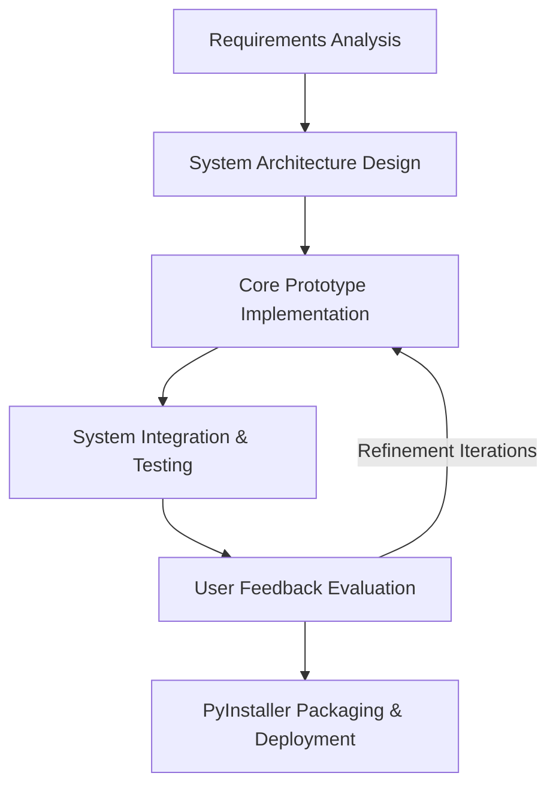
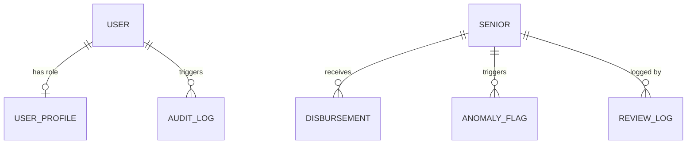
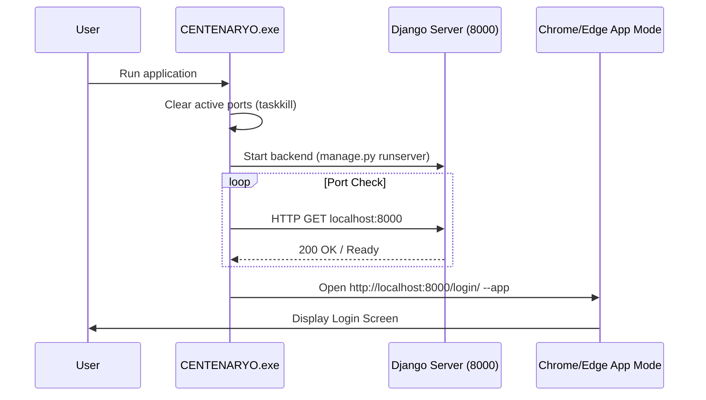
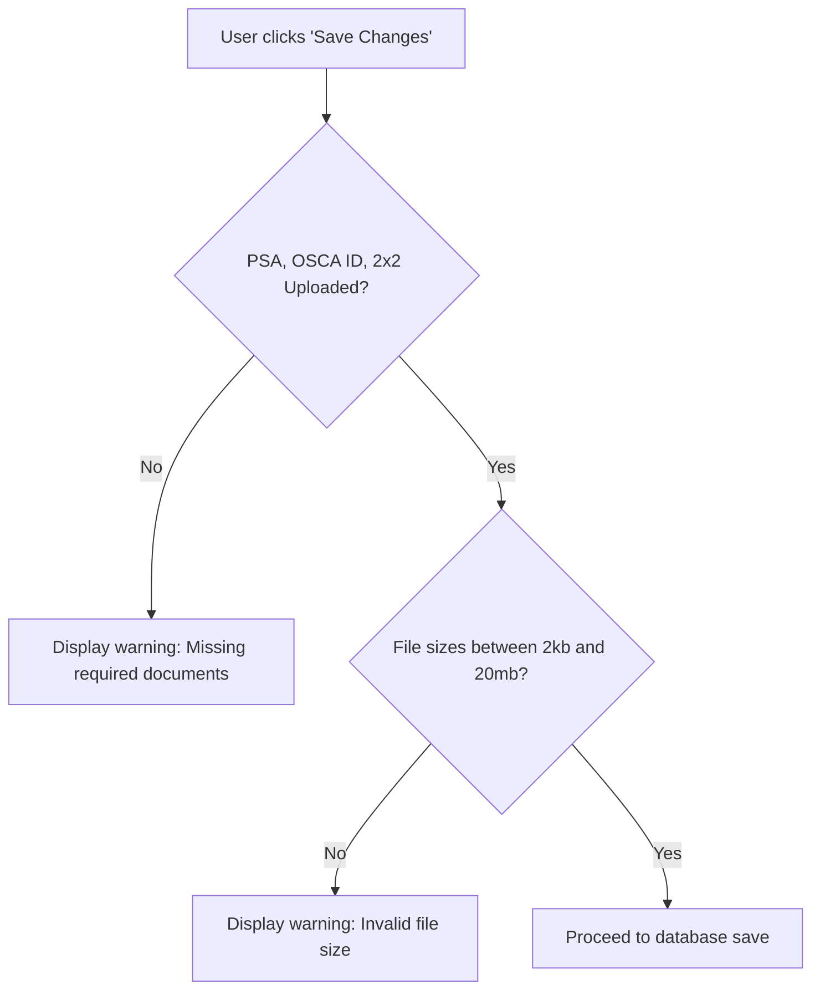
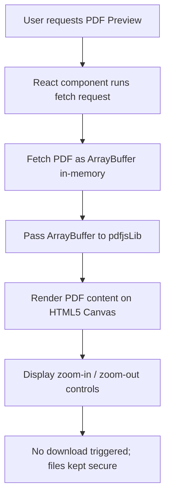
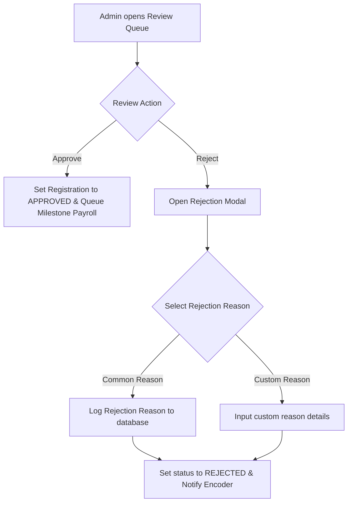

# 🇵🇭 CENTENARYO: Capstone Thesis Documentation
## Technical Specifications, System Workflows, and Implementation Framework (R.A. 11982)

---

## 🏛️ CHAPTER 1: INTRODUCTION

### 1.1 Project Context & Background
In the Philippines, the government enacted **Republic Act No. 11982** (The Expanded Centenarian Act), amending R.A. 10868, to honor Filipino senior citizens by granting financial milestones at key developmental ages:
*   **₱10,000 Milestone Gift**: Awarded to senior citizens upon reaching the ages of **80, 85, 90, and 95**.
*   **₱100,000 Centenarian Award**: Awarded to senior citizens upon reaching the milestone age of **100**.

At the Local Government Unit (LGU) and National Commission of Senior Citizens (NCSC) levels, administering this social welfare program introduces significant operational bottlenecks. Registries are frequently maintained on disconnected paper files or unstandardized spreadsheets. This fragmentation leads to:
1.  **Deceased Registry Overlaps (Ghost Beneficiaries)**: Lack of real-time death-verification records leads to disbursements mistakenly queued, processed, or released to deceased individuals.
2.  **Disbursement Delays**: Spreadsheets cannot calculate age dynamically relative to the current date, forcing staff to perform manual mathematical age computations for thousands of records.
3.  **Data Integrity & Format Loss**: Basic spreadsheet tools routinely drop leading zeros in OSCA IDs or misformat numerical strings upon CSV import/export.
4.  **Security Vulnerabilities & Lack of Audit Trails**: Normal spreadsheets lack trace logs, making records susceptible to unauthorized modification, identity theft, or double-claiming.

**CENTENARYO** was developed to resolve these issues by providing a local, standalone, offline-ready desktop administration portal. The system automates milestone calculations, implements a secure document verification gateway, monitors registration anomalies using machine learning, and maintains a strict transaction audit trail.

---

### 1.2 Statement of the Problem
The local implementation of R.A. 11982 at the LGU level suffers from four core technical and operational challenges:
1.  **Fragmentation of Beneficiary Registries**: LGUs manage records across separate local files that do not dynamically sync or update senior citizen ages. Manual age tracking is highly prone to human error, resulting in missed milestones or duplicate payments.
2.  **Registry Fraud and Ghost Claims**: Without automated verification layers, registry records are susceptible to identity hijacking. Payouts can be claimed multiple times under different spelling variations or processed for deceased individuals whose deaths went unrecorded in the system.
3.  **Browser Download Hijacking and Document Security Risks**: Traditional web-based file management tools rely on browser-level downloads or native browser PDF embeds. In LGU offices, third-party download accelerators (such as Internet Download Manager - IDM) hijack document preview requests, forcing the PDF to download locally to the workstation instead of presenting it inline. This exposes sensitive Personally Identifiable Information (PII) on public workstations and disrupts the review process.
4.  **Deployment Barriers for Offline Workstations**: Standard enterprise systems depend on persistent cloud connectivity and complex local database setups (requiring command-line Node.js, Python, and database configuration). Non-technical LGU encoders cannot troubleshoot or configure these setups on offline, local workstations.

---

### 1.3 Objectives of the Study
#### General Objective:
To design, develop, and implement **CENTENARYO**, an intelligent, secure, standalone desktop administration portal that automates milestone payroll calculations, enforces document verification, detects registration anomalies using machine learning, and logs audit trails offline for local LGUs under R.A. 11982.

#### Specific Objectives:
1.  **Zero-Configuration Native C# Launcher**: Develop a launcher (`CENTENARYO.exe`) that manages background database/server processes, performs port hygiene (cleaning port 8000), and launches the portal in a dedicated standalone app window.
2.  **Dynamic Milestone Engine**: Program an automated engine that calculates senior citizen ages relative to the system date and queues disbursement records without manual intervention.
3.  **Custom Inline Canvas-Based PDF Viewer**: Integrate an in-memory canvas-based PDF renderer (`PdfViewer`) that fetches files as raw `ArrayBuffer` blocks, bypassing browser extension downloads and preventing IDM hijacking.
4.  **Mandatory Upload Gatekeeper**: Enforce mandatory document verification requiring PSA Birth Certificates, OSCA IDs, and 2x2 photos within strict file limits (2kb to 20mb) to prevent incomplete submissions.
5.  **AI Anomaly Monitor**: Build a Random Forest Classifier to score registration risks (duplicate IDs, demographic velocity, milestone abnormalities) and automatically freeze pending payouts.
6.  **Secured Role-Based Access (RBAC)**: Partition operational roles, restricting document reviews, override actions, and IP audit trails exclusively to Administrator profiles.

---

### 1.4 Scope and Limitations
#### Scope:
*   **Functional Registry**: Supports Annex A profiling (names, birthdate, sex, barangay, and civil status including Divorced and Separated with spouse inputs).
*   **Security & Audit**: Implements session auditing (logins/logouts with IP addresses) and data modifications (CREATE, UPDATE, DELETE).
*   **Deployment**: Portable SQLite database (`db.sqlite3`) and Django/Next.js stack packaged into a single Windows directory using PyInstaller.

#### Limitations:
*   **Offline Standalone Mode**: Does not sync data to a cloud database by default. Data is stored on the host computer.
*   **Local Network Sync**: Multi-user operations require host folder sharing over a Local Area Network (LAN).

---

### 1.5 Significance of the Study
*   **Local Government Units (LGUs)**: Provides a zero-cost, offline administrative platform that removes manual errors.
*   **National Commission of Senior Citizens (NCSC)**: Restores data integrity and provides verified audit logs compliant with the Data Privacy Act (R.A. 10173).
*   **Filipino Senior Citizens**: Guarantees that milestone payouts are calculated accurately and released to legitimate beneficiaries without administrative delays.

---
---

## 📐 CHAPTER 3: SYSTEM METHODOLOGY & DESIGN

### 3.1 Software Development Life Cycle (SDLC)
The system was engineered using the **Agile Prototyping Model**. This allowed for iterative refinement of UI elements, validation rules, and document security features based on evaluation feedback.



---

### 3.2 System Architecture
The application runs as a hybrid desktop portal. It launches local background services and presents the user interface inside a frameless standalone window.

```
+-----------------------------------------------------------+
|                    CENTENARYO Launcher                    |
|  - Spawns background Django REST Server                   |
|  - Renders frameless Next.js SPA UI                       |
+-----------------------------------------------------------+
                             |
         +-------------------+-------------------+
         | (Local REST API Requests via JWT)         |
         v                                           v
+-------------------------------+           +-------------------+
|      Django API Gateway       |           |   SQLite Engine   |
|  - Milestone Calculator       | <-------> |   - core_senior   |
|  - Random Forest Classifier   |           |   - core_disburse |
|  - Audit Log Signal Handlers  |           |   - core_auditlog |
+-------------------------------+           +-------------------+
```

---

### 3.3 Database Schema & Data Dictionary

The relational structure of the SQLite database is illustrated in the Entity-Relationship Diagram (ERD):



#### 1. `core_senior` Table (Official Registry)
Stores senior citizen identity information, demographics, verification state, and file links.

| Column | Type | Constraints | Description |
| :--- | :--- | :--- | :--- |
| `id` | Integer | Primary Key, Auto-Increment | Unique identifier. |
| `first_name` | Varchar(100) | Not Null | Biological given name. |
| `last_name` | Varchar(100) | Not Null | Biological surname. |
| `middle_name` | Varchar(100) | Nullable | Middle name. |
| `date_of_birth`| Date | Not Null | Used to calculate dynamic age. |
| `osca_id` | Varchar(50) | Unique, Not Null | Format: OSCA-YYYY-SERIAL. Numbers only. |
| `barangay` | Varchar(100) | Not Null | Sorted alphabetically in registry. |
| `sex` | Varchar(10) | Not Null | Male, Female. |
| `civil_status` | Varchar(20) | Not Null | Single, Married, Widowed, Separated, Divorced. |
| `status` | Varchar(20) | Not Null | ACTIVE, DECEASED, TRANSFERRED, SUSPENDED. |
| `risk_score` | Float | Default: 0.0 | ML-predicted anomaly rating. |
| `annex_a_data` | JSON | Nullable | Stores address details and spouse names. |
| `psa_cert_file`| Varchar(100) | Nullable | File path for uploaded PSA Birth Certificate. |
| `primary_id_file`| Varchar(100)| Nullable | File path for uploaded OSCA ID Card. |
| `picture_2x2_file`| Varchar(100)| Nullable | File path for uploaded 2x2 Photo. |
| `registration_status`| Varchar(20)| Default: 'PENDING_REVIEW'| PENDING_REVIEW, APPROVED, REJECTED. |

#### 2. `core_disbursement` Table (Payroll Management)
Tracks milestone payout records issued to seniors.

| Column | Type | Constraints | Description |
| :--- | :--- | :--- | :--- |
| `id` | Integer | Primary Key | Payout record ID. |
| `senior_id` | Integer | Foreign Key | Linked beneficiary. |
| `disbursement_type`| Varchar(20)| Not Null | SOCIAL_PENSION, MILESTONE_GIFT. |
| `amount` | Decimal(10,2)| Not Null | Payout award (₱10,000 or ₱100,000). |
| `quarter` | Varchar(2) | Not Null | Q1, Q2, Q3, Q4. |
| `year` | Integer | Not Null | Target calendar year. |
| `status` | Varchar(20) | Not Null | PENDING, RELEASED, CANCELLED. |
| `reference_number`| Varchar(100)| Unique | Transaction confirmation code. |
| `release_date` | Date | Nullable | Payout execution date. |

#### 3. `core_auditlog` Table (Compliance Trail)
Tracks administrative changes and user sessions.

| Column | Type | Constraints | Description |
| :--- | :--- | :--- | :--- |
| `id` | Integer | Primary Key | Record ID. |
| `user_id` | Integer | Foreign Key | Operator who performed the action. |
| `action` | Varchar(50) | Not Null | CREATE, UPDATE, DELETE, LOGIN, LOGOUT. |
| `target_model` | Varchar(100) | Not Null | The affected database table. |
| `changes_summary`| Text | Not Null | Description of modified fields. |
| `ip_address` | Varchar(45) | Nullable | IP address of the workstation. |
| `created_at` | DateTime | Not Null | Operation timestamp. |

---

### 3.4 Operational System Workflows & Logic

#### 1. Zero-Configuration Process Hygiene (Launcher Loop)
To eliminate manual setup, the C# launcher (`CENTENARYO.exe`) handles the server ports and processes automatically:
*   Clears conflicting web servers by running `taskkill.exe /F /IM python.exe` and `node.exe`.
*   Starts the background Django server.
*   Polls `http://localhost:8000` until it returns a `200 OK` status, then opens the app in Chrome/Edge standalone mode.



#### 2. Mandatory Upload Gatekeeper & Size Validation
The registration form enforces strict upload rules to ensure data completeness:
*   Blocks submission if **PSA Birth Certificate**, **OSCA ID Card**, or **2x2 Photo** is missing.
*   Enforces file size constraints: rejects files smaller than **2KB** (to block corrupted/empty uploads) or larger than **20MB**.



#### 3. Custom Canvas-Based PDF Viewer (IDM Bypass)
To prevent download managers from hijacking PDF files, the custom `PdfViewer` component fetches documents in memory as an `ArrayBuffer` and renders them directly onto a canvas element.



#### 4. Admin-Only Document Review & Rejection Popup Workflow
*   **Role Separation**: Only users with the `ADMIN` profile can access the Review Queue.
*   **Direct Review & Rejection Options**: Checks are simplified to Approve or Reject.
*   **Rejection Reasons Modal**: Rejecting a registration triggers a modal displaying common reasons (e.g., blurry files, mismatched info) along with a custom text field for other issues.



---

### 3.5 Verification & Validation Plan
*   **Dynamic Boundary Testing**: Unit tests check eligibility milestones at exactly 80, 85, 90, 95, and 100 years.
*   **Document Verification Scenarios**: Verification checks verify file inputs (blocking files < 2KB or > 20MB) and ensure the system prevents incomplete applications.
*   **IDM Hijack Simulation**: Manual verification confirms that downloading of files is blocked and PDFs render securely on the inline canvas.

---
© 2026 CENTENARYO · Prepared for LGU Capstone Thesis Framework
