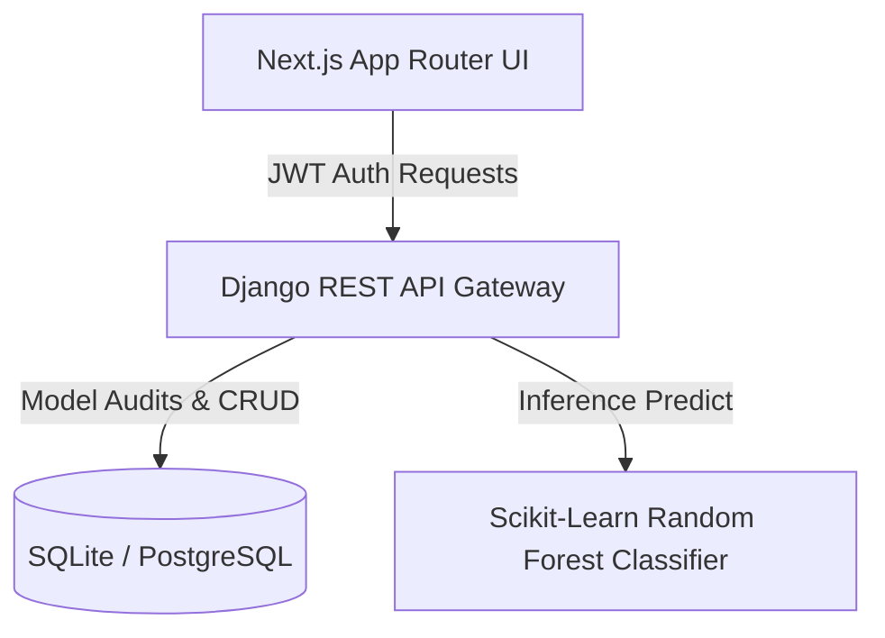
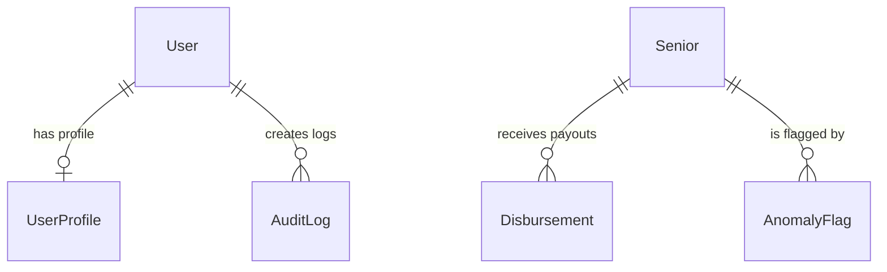

# 🇵🇭 CENTENARYO: Technical & Functional System Documentation
### Expanded Centenarian Act (R.A. 11982) Administrative Portal

---

## 📌 Executive Summary

**CENTENARYO** is an enterprise-grade, high-fidelity administrative platform built to automate and secure the implementation of **Republic Act No. 11982** (The Expanded Centenarian Act of the Philippines). 

The platform serves as the central operational hub for the **National Commission of Senior Citizens (NCSC)** and local government units (LGUs). It manages the entire lifecycle of milestone financial awards:
*   **₱10,000** milestone payouts for senior citizens reaching the ages of **80, 85, 90, and 95**.
*   **₱100,000** milestone payout for senior citizens reaching the age of **100**.

By combining modern cloud engineering, dynamic visual analytics, real-time auditing, and an **AI-powered Machine Learning anomaly detection classifier**, CENTENARYO ensures absolute transparency, halts ghost-voter syndicates, and guarantees fast, direct disbursement to eligible Filipino seniors.

---

## 🛠️ Complete Technology Stack



### 1. Frontend Architecture
*   **Framework**: [Next.js 15](https://nextjs.org/) using React 19, the App Router pattern, and Turbopack for optimal hot-reloading speed.
*   **Styling & Themes**: Custom Vanilla CSS coupled with Tailwind CSS for glassmorphism panels, harmonious soft colors, and fully responsive layouts.
*   **State Management**: React Context API providing global asynchronous states:
    *   `AuthContext`: Handles JWT token lifecycle, refresh rotations, and Role-Based Access Control (RBAC).
    *   `UI & Notification Context`: Houses the custom global toast/modal animation alerts.
*   **Icons & Visuals**: Lucide React.

### 2. Backend & Intelligence Engine
*   **Application Server**: [Django 6.0](https://www.djangoproject.com/) — secure, scalable, and highly structured python web framework.
*   **API Framework**: Django REST Framework (DRF) exposing secure serialized endpoints with standard paging.
*   **Authentication & Security**: Django SimpleJWT providing stateless JSON Web Tokens (Access and Refresh) with token rotations.
*   **Artificial Intelligence / Machine Learning**: [Scikit-learn](https://scikit-learn.org/) RandomForest Classifier. The model predicts registration anomalies in real-time by analyzing statistical indicators:
    *   Barangay density ratios.
    *   Duplicate OSCA IDs.
    *   High-frequency registration velocity.
    *   Abnormal milestones.

### 3. Data Storage & Deployment
*   **Database**: PostgreSQL (Production) / SQLite (Local development for zero-config setups).
*   **Hosting Pipelines**:
    *   Frontend: Vercel (Edge-optimized serverless rendering).
    *   Backend: Render (WSGI Application Container).

---

## 🗃️ Database Schema & Data Models

The system is structured around 5 highly optimized models:



### 1. `Senior` (Beneficiary Registry)
Represents the official government profiles of registered senior citizens under Annex A:
*   `first_name` & `last_name` (`CharField`): Biological names.
*   `date_of_birth` (`DateField`): Birth date (drives dynamic milestone calculations).
*   `osca_id` (`CharField`): Unique Senior Citizen Identification number.
*   `barangay` (`CharField`): Geographic locality within the LGU.
*   `sex` (`CharField`): Male or Female biological sex.
*   `civil_status` (`CharField`): Single, Married, Widowed, or Separated.
*   `status` (`CharField`): Registry status (ACTIVE, DECEASED, SUSPENDED, TRANSFERRED).
*   `annex_a_data` (`JSONField`): Supplementary fields (Representative names, contact details, ID verification checklists).

### 2. `Disbursement` (Financial Payroll Records)
Tracks all financial payouts issued under the centenarian milestones:
*   `senior` (`ForeignKey`): Beneficiary senior.
*   `disbursement_type` (`CharField`): `SOCIAL_PENSION` or `MILESTONE_GIFT`.
*   `amount` (`DecimalField`): Award amount (₱3,000, ₱10,000, or ₱100,000).
*   `quarter` & `year` (`CharField`/`IntegerField`): Distribution period.
*   `status` (`CharField`): Payout states (`PENDING`, `RELEASED`, `CANCELLED`).
*   `reference_number` (`CharField`): Unique transaction ID.
*   `release_date` (`DateTimeField`): Payout execution timestamp.

### 3. `AuditLog` (Session and Transaction Trail)
Maintains a read-only historical record of all data modifications and user authentication sessions:
*   `user` (`ForeignKey`): User executing the operation.
*   `action` (`CharField`): Transaction categories (`CREATE`, `UPDATE`, `DELETE`, `LOGIN`, `LOGOUT`).
*   `target_model` & `target_object_id` (`CharField`): Tracks which model was modified.
*   `changes_summary` (`TextField`): Clear descriptive logs of the action.
*   `ip_address` (`GenericIPAddressField`): Client's network identifier.
*   `created_at` (`DateTimeField`): Audit timestamp.

### 4. `AnomalyFlag` (Intelligent Fraud Monitoring)
Stores ML-inferred anomaly detections and their resolution states:
*   `senior` (`ForeignKey`): Senior record flagged as anomalous.
*   `reason` (`TextField`): Explanation of the flag (e.g., duplicate IDs, high velocity).
*   `is_resolved` (`BooleanField`): Resolution status.
*   `resolved_by` (`ForeignKey`): Admin user who resolved the anomaly.
*   `resolved_at` (`DateTimeField`): Timestamp of resolution.

### 5. `UserProfile` (Role-Based Access Profiles)
Assigned to system users to drive access permissions:
*   `user` (`OneToOneField`): Linked Django user.
*   `role` (`CharField`): RBAC role (`ADMIN` or `STAFF`).

---

## 🎮 Functional Modules Breakdown

### 🏛️ 1. Unified Senior Registry
Operational database for managing senior profiles:
*   **Annex A Profile Form**: Advanced data entry including full biometrics, biological **Sex**, and **Civil Status** dropdown panels.
*   **Dynamic Milestones**: Calculates age relative to the current date and determines eligibility for the RA 11982 milestones.
*   **Verification Gate**: High-stakes validation steps where staff can review birth certificates and upload identity attachments.
*   **Registry Ratios**: Data is deterministically seeded to maintain target ratios:
    *   **88% Active** (Soft Green)
    *   **4% Deceased** (Soft Rose - used to clean ghost registries)
    *   **4% Suspended** (Soft Amber - flagged for security)
    *   **4% Transferred** (Soft Slate-Gray - transferred to other LGUs)

---

### 📊 2. Premium Admin Analytics Dashboard
A real-time visual cockpit displaying NCSC statistics:
*   **Demographics Breakdown**: Real-time **Sex Ratio** bar charts pulling data from `Senior.objects.filter(sex=...)` dynamically.
*   **Civil Status Tracker**: Four visual cards showing active counts of Married, Widowed, Single, and Separated beneficiaries.
*   **Registry Clean-up & Mortality Donut Chart**: A visually stunning donut chart reflecting the 88:4:4:4 database split. Overlapping label color indicators are resolved using color-matched indicator tags:
    *   🟢 **Active Citizens**
    *   🔴 **Deceased (Cleaned)**
    *   🟡 **Suspended/Fraud**
    *   ⚫ **Transferred Out**
*   **KPI Cards**: Aggregated counters displaying Total Registered Seniors, Total Payouts Disbursed, flagged active ML Anomalies, and remaining pipeline funds.

---

### 💰 3. Smart Payout Engine
Handles the financial payroll generation for the LGU:
*   **Automatic Payout Allocation**: Scans the database and generates a `Disbursement` entry whenever a senior hits 80, 85, 90, 95, or 100.
*   **Payout Freeze Locking**: If a senior's registry profile is flagged by the ML engine as anomalous, all of their pending disbursements are automatically frozen to prevent state budget leaks.
*   **Real-time Release Checklist**: Gated interfaces where staff can input reference numbers and mark payments as `RELEASED`.

---

### 🧠 4. AI-Powered Anomaly Detection Portal
Protects the award program from syndicate rings and deceased identity hijacks:
*   **ML RandomForest Classifier**: Evaluates senior records during registration or import. If the feature weights exceed suspicious thresholds, it creates an `AnomalyFlag`.
*   **Global Admin Security Locks**: Gated interface accessible exclusively by **ADMIN** profiles. 
*   **Two-Way Resolution Choices**:
    *   *Dismiss Flag*: The Admin clears the flag as a false alarm; the senior's registry returns to Normal and payouts are unfrozen.
    *   *Suspend Record*: The Admin confirms the fraud; the senior's profile status changes permanently to `SUSPENDED` and all pending disbursements are marked as `CANCELLED`.

---

### 🛡️ 5. Secure Session & Transaction Auditing
Provides a complete digital trail to meet **Data Privacy Act (RA 10173)** guidelines:
*   **Dual-Session Auditing**:
    *   **Logins**: Captures successful sign-in tokens using a custom JWT override view.
    *   **Logouts**: Captures explicit user sign-out signals asynchronously, notifying the backend view `/api/logout/` before purging tokens.
*   **All-in-One LOGINS Filter**: Grouped filter displaying an elegant, chronological session timeline containing both indigo `LOGIN` badges and slate-gray `LOGOUT` badges.
*   **Multi-Tier Filtering**: Filter audits instantly by action (CREATE, UPDATE, DELETE, LOGINS) or search terms (queries usernames, affected models, or changes).
*   **Standard Pagination**: Loads logs in swift paginated lists of 50 per page to save network bandwidth.

---

## 🔒 Security & RBAC Matrix

The system implements a strict Role-Based Access Control matrix to partition operational duties:

| Functional Area | STAFF Role | ADMIN Role | Security Mechanism |
| :--- | :---: | :---: | :--- |
| **Register Seniors** | ✅ Yes | ✅ Yes | DRF Model Permissions |
| **Verify Payouts** | ✅ Yes | ✅ Yes | DRF Model Permissions |
| **Trigger Disbursements** | ✅ Yes | ✅ Yes | DRF Model Permissions |
| **View Dashboard** | ✅ Yes | ✅ Yes | Auth Token Validation |
| **Resolve ML Anomalies** | ❌ No | ✅ Yes | Custom `IsAdmin` Backend Permission |
| **View Audit Logs** | ❌ No | ✅ Yes | Custom `IsAdmin` Backend Permission |
| **Track Sessions (IP Address)**| ❌ No | ✅ Yes | Network Socket Metadata |

---

## 🚀 Installation & Local Environment Setup

### 1. Prerequisites
*   **Node.js**: Version 18.0.0 or higher.
*   **Python**: Version 3.10 or higher.

### 2. Backend Installation (Django API)
```powershell
cd backend
python -m venv venv
.\venv\Scripts\activate  # Source venv/bin/activate on macOS/Linux

# Install backend dependencies
pip install -r requirements.txt

# Run migrations and setup local database
python manage.py migrate

# Seed 100 seniors, milestones, and audit session logs
python manage.py seed_data

# Start local server on port 8000
python manage.py runserver
```

### 3. Frontend Installation (Next.js App)
```powershell
cd ../frontend
npm install
```
*   **Running Next.js on Windows (Bypassing Execution Policies)**:
    If your Windows PowerShell blocks executing script wrappers, start the dev server using command-prompt scripts:
    ```powershell
    npm.cmd run dev
    ```
    *Otherwise, on macOS/Linux:*
    ```bash
    npm run dev
    ```

### 4. Default Login Access
*   **Admin Dashboard View**: Username: `admin` | Password: `admin123`
*   **Staff Registry View**: Username: `staff` | Password: `staff123`

---
© 2026 CENTENARYO · National Commission of Senior Citizens (NCSC)
