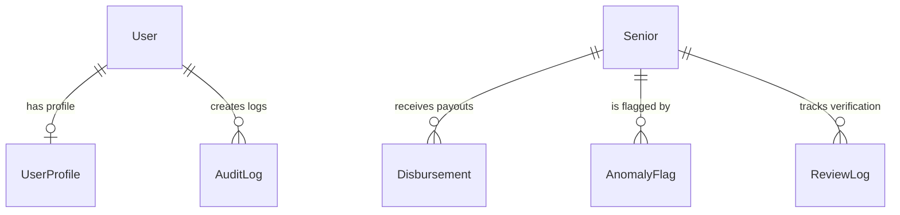

# 🇵🇭 CENTENARYO: Technical & Functional System Documentation
### Expanded Centenarian Act (R.A. 11982) Administrative Portal

---

## 📌 Executive Summary

**CENTENARYO** is a specialized administrative platform built to automate and secure the local implementation of **Republic Act No. 11982** (The Expanded Centenarian Act of the Philippines). 

The platform serves as the central operational hub for the **National Commission of Senior Citizens (NCSC)** and local government units (LGUs). It manages the entire lifecycle of milestone financial awards:
*   **₱10,000 milestone payouts** for senior citizens reaching the ages of **80, 85, 90, and 95**.
*   **₱100,000 milestone payout** for senior citizens reaching the age of **100**.

By combining standalone local application services, dynamic visual analytics, real-time auditing, and an **AI-powered Random Forest anomaly detection classifier**, CENTENARYO ensures absolute transparency, prevents duplicate claims, and guarantees fast, direct disbursement to eligible Filipino seniors.

---

## 🛠️ Complete Technology Stack

```
+-------------------------------------------------------------+
|                     Next.js Frontend (UI)                   |
|  - Custom CSS & Tailwind UI Controls                        |
|  - In-Memory Canvas-Based PDF Viewer (Bypasses IDM)         |
+-------------------------------------------------------------+
                              |
                     (JWT Auth API Requests)
                              v
+-------------------------------------------------------------+
|                      Django REST Backend                    |
|  - Role-Based Access Control (Admin / Staff)                |
|  - Random Forest Machine Learning Classifier                |
|  - Signal-Driven Audit Logging Engine                       |
+-------------------------------------------------------------+
                              |
                    (Local Read/Write Queries)
                              v
+-------------------------------------------------------------+
|                    SQLite Database Engine                   |
|  - db.sqlite3 (Full offline portability)                     |
+-------------------------------------------------------------+
```

### 1. Frontend Architecture
*   **Framework**: [Next.js 15](https://nextjs.org/) using React 19, the App Router pattern, and Turbopack for optimal hot-reloading speed.
*   **Styling & Themes**: Custom Vanilla CSS coupled with Tailwind CSS for glassmorphism panels, soft colors, and fully responsive layouts.
*   **State Management**: React Context API providing global asynchronous states:
    *   `AuthContext`: Handles JWT token lifecycle, refresh rotations, and Role-Based Access Control (RBAC).
    *   `UI & Notification Context`: Houses custom global toast/modal animation alerts.
*   **Custom PDF Renderer**: Canvas-based interactive PDF viewer (`PdfViewer.tsx`) powered by `pdfjs-dist`. It fetches PDF files in-memory as an `ArrayBuffer` to bypass browser download managers like IDM, rendering page canvases with zoom-in/out and reset controls.

### 2. Backend & Intelligence Engine
*   **Application Server**: [Django 6.0](https://www.djangoproject.com/) — secure, scalable, and highly structured python web framework.
*   **API Framework**: Django REST Framework (DRF) exposing secure serialized endpoints with standard paging.
*   **Authentication & Security**: Django SimpleJWT providing stateless JSON Web Tokens (Access and Refresh) with token rotations.
*   **Artificial Intelligence / Machine Learning**: [Scikit-learn](https://scikit-learn.org/) RandomForest Classifier. The model predicts registration anomalies in real-time by analyzing statistical indicators:
    *   Barangay density ratios.
    *   Duplicate OSCA IDs.
    *   High-frequency registration velocity.
    *   Abnormal milestones.

### 3. Data Storage & Desktop Integration
*   **Database**: SQLite, storing data in a single portable file (`backend/db.sqlite3`).
*   **Native Process Orchestration**: C# WinForms App (`CENTENARYO.exe`) acting as a native process launcher. It cleans ports (8000), starts Django, checks server readiness, and loads Chrome/Edge in `--app` standalone mode.
*   **Portable Packaging**: Packaged via PyInstaller (`build_portable.bat`) into a standalone distribution directory.

---

## 🗃️ Database Schema & Data Models



### 1. `Senior` (Beneficiary Registry)
Represents the official government profiles of registered senior citizens under Annex A:
*   `first_name` & `last_name` (`CharField`): Biological names.
*   `date_of_birth` (`DateField`): Birth date (drives dynamic milestone calculations).
*   `osca_id` (`CharField`): Unique Senior Citizen Identification number (validated as numbers-only, max 15 digits).
*   `barangay` (`CharField`): Geographic locality (sorted alphabetically).
*   `sex` (`CharField`): Male or Female biological sex.
*   `civil_status` (`CharField`): Single, Married, Widowed, Separated, or Divorced.
*   `status` (`CharField`): Registry status (`ACTIVE`, `DECEASED`, `SUSPENDED`, `TRANSFERRED`).
*   `annex_a_data` (`JSONField`): Supplementary fields (Representative names, contact details, spouse name input for Married and Separated seniors).
*   `psa_cert_file` (`FileField`): File path to the uploaded PSA Birth Certificate.
*   `primary_id_file` (`FileField`): File path to the uploaded OSCA ID Card.
*   `picture_2x2_file` (`ImageField`): File path to the uploaded 2x2 Photo.
*   `registration_status` (`CharField`): Registration workflow state (`PENDING_REVIEW`, `APPROVED`, `REJECTED`).

---

## 🎮 Functional Modules Breakdown

### 🏛️ 1. Unified Senior Registry
*   **Annex A Profile Form**: Advanced data entry including full biometrics, biological **Sex**, and **Civil Status** dropdown panels.
*   **Alphabetized Barangays**: All local barangay names are presented in alphabetical order to streamline data entry.
*   **Expanded Civil Status**: Added support for `Divorced` and `Separated` states. If `Separated` is selected, the spouse/partner name field is kept active since the individual is still legally married.
*   **Mandatory Document Gatekeeper**: Enforces strict verification. Users cannot save changes or complete registration unless all three required files (PSA, OSCA ID, and 2x2 Photo) are uploaded.
*   **Strict Size Limits**: Rejects files under **2KB** (to prevent corrupted/empty files) or over **20MB** to save local disk space.

### 💰 2. Smart Payout Engine
*   **Automatic Payout Allocation**: Generates a `Disbursement` entry whenever a senior hits 80, 85, 90, 95, or 100.
*   **Payout Freeze Locking**: If a senior's registry profile is flagged by the ML engine as anomalous, all pending disbursements are automatically frozen to prevent state budget leaks.

### 🛡️ 3. Admin-Only Review Queue & Rejection Workflow
*   **Gated Access**: Accessible exclusively by **ADMIN** profiles. Users logged in as `STAFF` cannot access or view the Review Queue.
*   **Canvas-Based Document Preview**: Evaluates document uploads inline. Instead of initiating browser downloads or embeds (which triggers IDM hijack popups), PDFs are loaded as an `ArrayBuffer` and rendered onto an HTML5 canvas with interactive Zoom (In, Out, Reset) controls.
*   **Simplified Review Decision**: Registrations can only be Approved or Rejected.
*   **Rejection Reason Popup**: Rejecting a registration triggers a modal displaying common reasons (e.g. blurry uploads, mismatched names) along with a custom text field for custom reasons.

### 🧠 4. AI-Powered Anomaly Detection Portal
*   **ML RandomForest Classifier**: Evaluates records during registration. If anomaly weights exceed threshold scores, it creates an `AnomalyFlag`.
*   **Oversight Override Interface**: Admin-only interface to either dismiss the anomaly (unfreezing payouts) or confirm fraud (suspending the record and cancelling pending disbursements).

### 🛡️ 5. Secure Session & Transaction Auditing
*   **Dual-Session Auditing**: Captures chronological timelines for both user Logins and Logouts, including IP addresses, to comply with the **Data Privacy Act (R.A. 10173)**.
*   **Audit Filtering**: Admin-only tool to search and filter logs by action (CREATE, UPDATE, DELETE, LOGIN/LOGOUT) or text.

---

## 🔒 Security & RBAC Matrix

The system implements a strict Role-Based Access Control matrix to partition operational duties:

| Functional Area | STAFF Role | ADMIN Role | Security Mechanism |
| :--- | :---: | :---: | :--- |
| **Register Seniors** | ✅ Yes | ✅ Yes | DRF Model Permissions |
| **Verify Payouts** | ✅ Yes | ✅ Yes | DRF Model Permissions |
| **Trigger Disbursements**| ✅ Yes | ✅ Yes | DRF Model Permissions |
| **View Dashboard** | ✅ Yes | ✅ Yes | Auth Token Validation |
| **Resolve ML Anomalies** | ❌ No | ✅ Yes | Custom `IsAdmin` Backend Permission |
| **View Audit Logs** | ❌ No | ✅ Yes | Custom `IsAdmin` Backend Permission |
| **View Review Queue** | ❌ No | ✅ Yes | Custom `IsAdmin` Backend Permission |

---

## 🚀 Installation & Local Environment Setup

### 1. Prerequisites
*   **Node.js**: Version 18.0.0 or higher.
*   **Python**: Version 3.10 or higher.

### 2. Setting Up a New Workstation
When cloning or downloading the system as a ZIP file on a new computer, run the setup script to configure dependencies and build the static frontend files:

1.  Open your command prompt or terminal in the project directory (`cen4`).
2.  Run the setup script:
    ```cmd
    setup_new_pc.bat
    ```
    *This script automatically configures the Python virtual environment, installs backend dependencies (including PyInstaller), installs Node packages, runs migrations, seeds mock data, compiles the Next.js static files, and creates the native launcher.*

### 3. Compiling the Portable Executable
Once the system is set up, compile the portable application folder for sharing via USB:

1.  Run the portable build script:
    ```cmd
    build_portable.bat
    ```
2.  Once completed, copy the compiled folder located at:
    `cen4\dist\CENTENARYO`
3.  Double-click **`CENTENARYO.exe`** inside that folder to run the application on any Windows computer without any additional setups.

### 4. Running the System Live for Development
If you want to run the system live in development mode (with auto-reload enabled):

1.  Start the backend Django server:
    *   Run `run_servers.bat` in the root folder (runs the API on `http://127.0.0.1:8000`).
2.  Start the Next.js development server:
    *   Open a new terminal in the `frontend` folder and run:
        ```powershell
        npm.cmd run dev
        ```
    *   Access the live dev app at: `http://localhost:3000`

---
© 2026 CENTENARYO · National Commission of Senior Citizens (NCSC)
